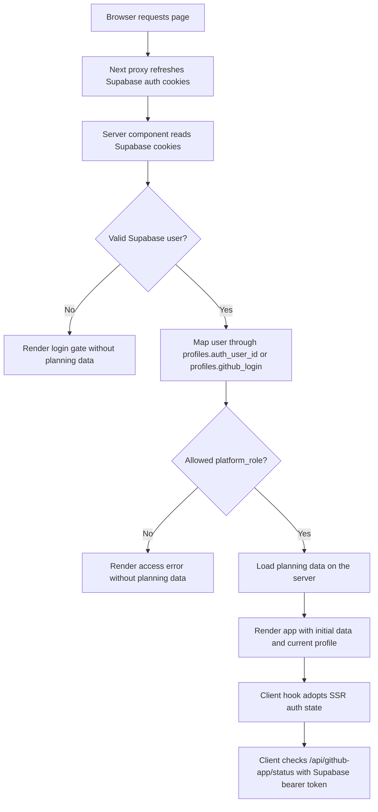
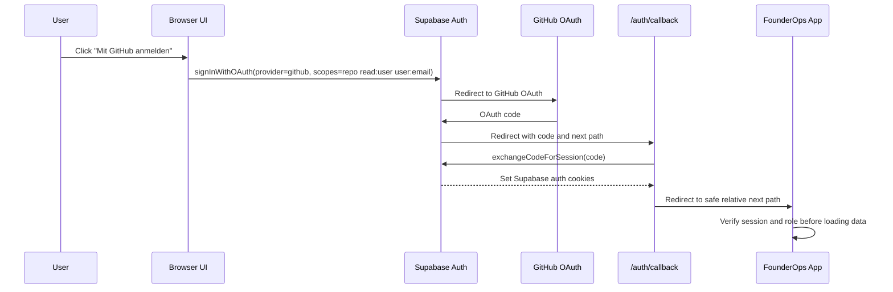
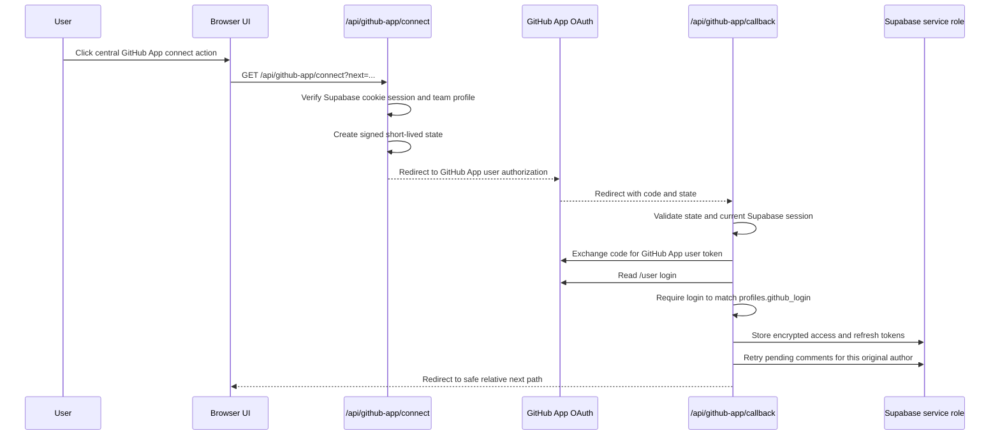
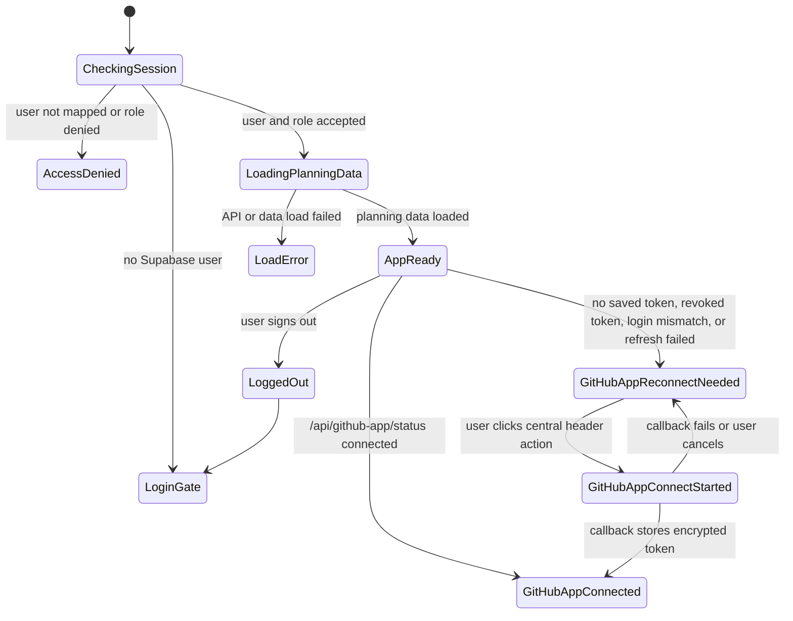
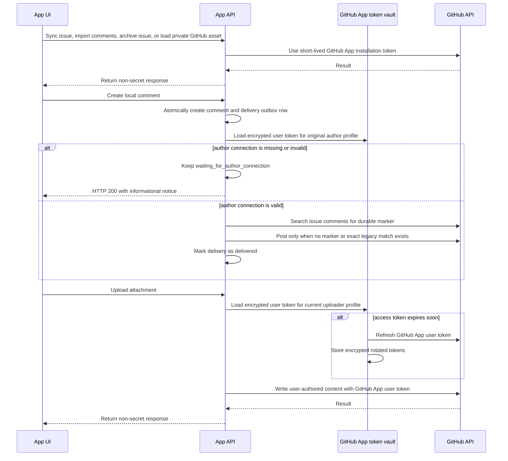

# Authentication Flow

This document is the source of truth for the FounderOps web authentication flow. It covers the Supabase session, role authorization, reload-stable GitHub App connections, and the UI states shown during reconnects.

## Principles

- Supabase owns the user session and refresh token through SSR-compatible auth cookies.
- `profiles.platform_role` is the application authorization boundary.
- Planning data is never rendered or serialized in strict auth mode until the request has a verified Supabase user and a mapped profile role.
- GitHub issue sync, dependencies, GitHub comment import, private asset proxying, and issue archival use server-side GitHub App installation tokens.
- User-authored GitHub comments and attachments use the original author's encrypted server-side GitHub App user token with refresh rotation.
- Every valid mapped team session, including viewers, may trigger issue sync. Task mutations and comment creation keep their stricter role rules.
- Issue projection status and comment delivery status are independent. A missing author connection never turns a successful issue sync into a failure.
- GitHub App user tokens are never exposed to the browser, logs, GitHub issues, API responses, or documentation.
- GitHub reconnect UI is centralized in the header/notification area. GitHub-dependent cards may show disabled actions, but they must not repeat their own reconnect button or start OAuth automatically.

## Production Boot

## Supabase GitHub Login

Supabase GitHub login is only the application login path. It restores the FounderOps session after reloads and maps the user to a team profile. It is not used as the GitHub API credential for FounderOps GitHub operations.

## GitHub App Connect: Author Connection

## Runtime UI States

## GitHub API Credential Rules

## Scenario Expectations

- Page reload with a valid session: the server verifies the cookie session, loads planning data, and the client checks `/api/github-app/status`. It must not flash the login gate.
- Browser closed and reopened: Supabase cookies restore the app session when still valid; the saved encrypted GitHub App user token keeps GitHub comments and attachments usable without another manual reconnect.
- Laptop standby then resume: the proxy and client refresh paths refresh the Supabase session. `/api/github-app/status` refreshes a soon-expiring GitHub App user access token when possible.
- Missing, revoked, expired, or mismatched GitHub App user connection: issue sync remains available. A locally saved comment waits for its original author's connection and is retried after OAuth reconnect or a later task/bulk sync. It must not start OAuth only because a task was opened.
- Expired or revoked Supabase session: the app clears protected client state and returns to the login gate.

## Token Handling

Allowed:

- Supabase SSR auth cookies managed by `@supabase/ssr`.
- Process-memory GitHub App installation token cache.
- Encrypted GitHub App user access and refresh tokens in `github_app_user_tokens`, readable only through service-role server code.

Forbidden:

- Sending raw GitHub tokens to the browser or accepting `x-github-provider-token` request headers.
- Persisting raw GitHub tokens in `localStorage`, `sessionStorage`, IndexedDB, logs, GitHub issues, API responses, or documentation.
- Persisting Supabase access tokens, refresh tokens, or `Authorization` headers outside Supabase auth cookies.
- Adding multiple component-local reconnect buttons across GitHub-dependent cards.
- Starting GitHub OAuth automatically when a user opens a task, settings page, or other GitHub-dependent view.
