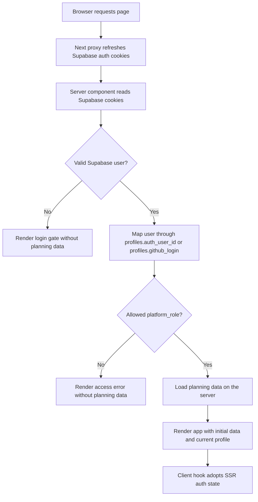
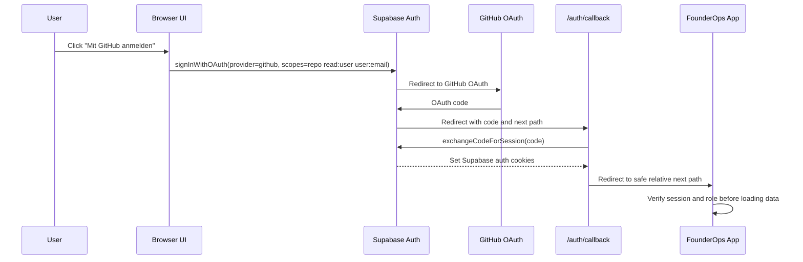
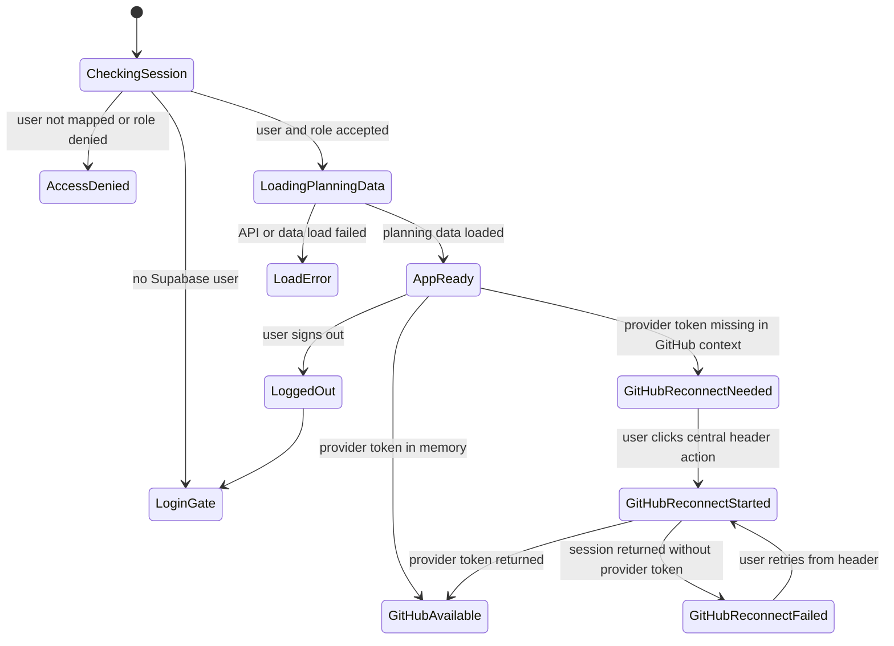
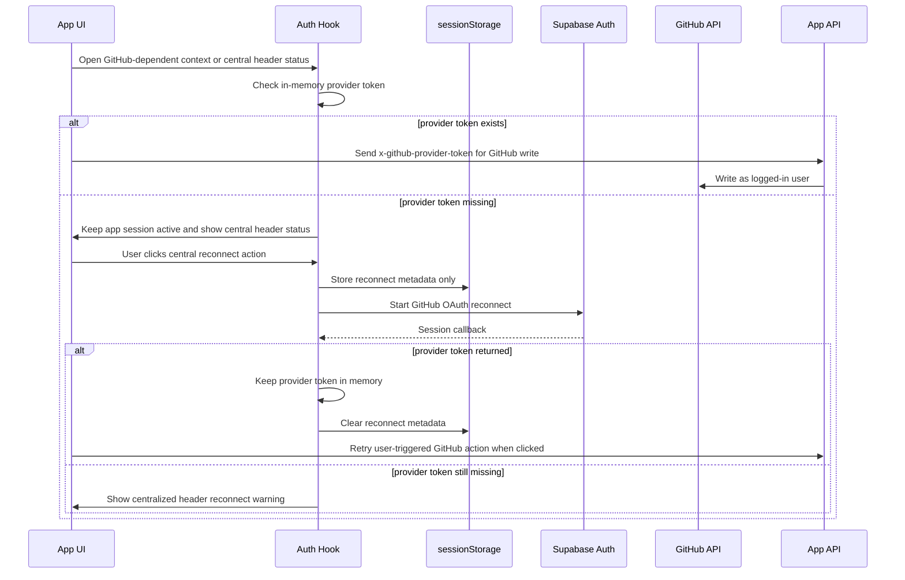

# Authentication Flow

This document is the source of truth for the FounderOps web authentication flow. It covers the Supabase session, role authorization, GitHub provider-token handling, and the UI states shown during reloads or reconnects.

## Principles

- Supabase owns the user session and refresh token through SSR-compatible auth cookies.
- `profiles.platform_role` is the application authorization boundary.
- Planning data is never rendered or serialized in strict auth mode until the request has a verified Supabase user and a mapped profile role.
- The GitHub provider token is used only for user-attributed GitHub writes and stays in browser memory.
- The app may store short-lived reconnect metadata in `sessionStorage`, but it must not store Supabase tokens, refresh tokens, GitHub provider tokens, or `Authorization` headers.
- GitHub reconnect UI is centralized in the header/notification area. GitHub-dependent cards may show disabled actions, but they must not repeat their own reconnect button or start OAuth automatically.

## Production Boot

## Supabase GitHub Login

## Runtime UI States

## GitHub Provider Token Reconnect

## Scenario Expectations

- Page reload with a valid session: the server verifies the cookie session, loads planning data, and the client shows either the app or a loading shell. It must not flash the login gate.
- Browser closed and reopened: Supabase cookies restore the session when still valid; otherwise the login gate appears without serialized planning data.
- Laptop standby then resume: the proxy and client refresh paths refresh the Supabase session. If only the GitHub provider token is missing, the app remains usable and exposes one central reconnect action for GitHub-backed actions. It must not start OAuth only because a task was opened.
- Expired or revoked Supabase session: the app clears protected client state and returns to the login gate.

## Token Handling

Allowed:

- Supabase SSR auth cookies managed by `@supabase/ssr`.
- In-memory GitHub provider token for the active tab/session.
- Reconnect metadata in `sessionStorage`, limited to user id, reason, return path, and timestamp.

Forbidden:

- Persisting GitHub provider tokens in `localStorage`, `sessionStorage`, IndexedDB, Supabase, logs, or GitHub issues.
- Persisting Supabase access tokens, refresh tokens, or `Authorization` headers outside Supabase auth cookies.
- Adding multiple component-local reconnect buttons across GitHub-dependent cards.
- Starting GitHub OAuth automatically when a user opens a task, settings page, or other GitHub-dependent view.
