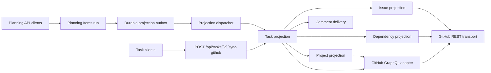

# GitHub Projection Architecture

FounderOps and Supabase are authoritative. GitHub is a one-way projection used for collaboration and technical history. The HTTP endpoint accepts an explicit command; it does not make GitHub a source of truth.

## Modules



| Module | Interface | Responsibility |
| --- | --- | --- |
| `src/lib/github-sync/task-projection.ts` | `projectTaskToGitHub` | Eligibility, lock, reload, compare-and-set transitions, ordering, error persistence, and final result |
| `src/features/planning-items/model/planning-items-github-projection.ts` | `dispatchPlanningGitHubProjections` | Durable claim, lease recovery, terminal result persistence, and receipt refresh |
| `src/lib/github-sync/issue-projection.ts` | `projectTaskGitHubIssue` | Issue document, labels, state, ownership marker, assignee, recovery, and creation |
| `src/lib/github-sync/dependency-projection.ts` | `projectTaskGitHubDependencies` | Local relationship resolution and complete native dependency reconciliation |
| `src/lib/github-sync/project-projection.ts` | `projectTaskToFounderOpsGitHubProject` | Project settings, membership, Sprint context, and native field reconciliation |
| `src/lib/github-graphql.ts` | `githubGraphql` | GraphQL transport envelope, errors, missing data, and read/mutation classification |
| `src/lib/github-comment-delivery.ts` | `deliverPendingGitHubComments` | Independent author-attributed comment outbox delivery |

`src/lib/github-project.ts` is intentionally limited to administrative Project validation.

## Command and sequence

The external command is:

```ts
projectTaskToGitHub({
  supabase,
  installationToken,
  taskId,
  actorProfileId,
  createIfMissing,
})
```

Planning API commits store the Planning mutation, idempotency receipt, and one
projection request per eligible item in the same database transaction. `async`
returns HTTP `202` only after that request is durable. Next.js `after()` wakes
the dispatcher to reduce latency, but correctness comes from the durable queue
and maintenance drain. `wait` claims and processes the same request before
returning; it never calls GitHub around the queue. Projection and notification
delivery remain outside the Planning transaction, so GitHub failure never
rolls back authoritative FounderOps state.

Projection and close/reopen lifecycle requests use one item-wide delivery
sequence. A later action cannot overtake an unfinished earlier action for the
same item. Claim leases recover abandoned work after a crash. Replaying a
Planning idempotency key reads the original request and receipt and creates no
additional projection request.

The HTTP body uses the browser-safe `TaskGitHubSyncCommand` contract and must contain an explicit Boolean `createIfMissing`. The Route Handler rejects absent or non-Boolean creation intent before acquiring a GitHub token or entering the projection module.

The order is contractual:

1. Load the task and validate active state, repository, approval, creation intent, and local GitHub references.
2. Acquire the resource lock.
3. Reload and fully revalidate the task and parent under the lock.
4. Read and validate the native Sub-Issue parent when applicable.
5. Begin the compare-and-set transaction immediately before projection mutations.
6. Apply the Issue projection.
7. Apply the Dependency projection or native Sub-Issue parent relationship.
8. Ensure GitHub Project membership, then reconcile Project fields as warning-only work.
9. Read linked Pull Requests as warning-only history.
10. Finalize the compare-and-set transaction.
11. Start Comment delivery as best effort.
12. Release the lock on every exit after acquisition.

Hard failures stop the workflow and persist `failed`. A stale compare-and-set result is retryable and is never persisted as a projection failure. Project field, linked Pull Request, and Comment delivery failures cannot roll back a successful core projection.

Lock release is part of the typed outcome. A returned or thrown release error produces retryable `github_sync_unavailable` instead of reporting success; a finalized task patch is retained when the core projection already completed.

## Response contract

`src/lib/github-sync/contract.ts` is browser-safe and owns the success and failure union, HTTP status mapping, retryability, and client classifier.

- Success always uses `ok: true`, `code: "github_sync_succeeded"`, the projected Issue identity, the task patch, warnings, Comment delivery summary, and notices.
- Failure always uses `ok: false`, a `TaskGitHubSyncErrorCode`, a public error, explicit retryability, and an optional task patch.
- Authentication and infrastructure failures use the same union as projection failures. Their API-context status metadata remains authoritative, including the existing `501` response when Supabase is not configured.
- Task creation, detail, single-sync, and bulk-sync flows use `classifyTaskGitHubSyncResponse`; callers must not add status/code exceptions.

## Identities

- The authenticated FounderOps profile authorizes the command and is recorded as the lock actor.
- The GitHub App installation token performs Issue, relationship, Project, and read-only Pull Request projection work. It is never returned to the browser or persisted as projection state.
- Comment delivery uses the encrypted GitHub App user token of the original comment author. A missing author connection affects only that comment.
- The durable Issue identity is the allowed repository plus issue number and the `founderops-task-id` marker.
- Dependency identities are validated endpoint pairs. Project membership is the observed Project ID plus Issue node ID.

## Idempotency

Every mutation follows `observe → compare → apply → reconcile`.

- Issue creation searches the durable task marker before creating.
- Issue updates validate repository, number, URL, resource kind, and ownership before patching.
- Dependency projection observes both native `blocked_by` and `blocking` directions for the current Issue, uses the full task registry to recognize trashed FounderOps counterparts, and mutates only a difference involving the current Issue.
- Project membership observes existing membership before adding.
- Project and Issue fields compare current native values before serial updates.
- Mutations are never blindly retried. After an ambiguous response, the next command observes GitHub again.

See `docs/github-api-idempotency.md` for transport and resource rules.

## Adding a projection step

Before adding a step:

1. Define the FounderOps-owned source state and the exact GitHub representation.
2. Decide whether failure is hard or warning-only and place it after all preceding hard work.
3. Define the durable resource identity and replay behavior.
4. Implement `observe → compare → apply → reconcile` in the owning projection module.
5. Route GraphQL through `githubGraphql` and REST through `github-http.ts`.
6. Serialize mutations; do not add mutation batches or automatic mutation retries.
7. Add behavior tests through the owning projection interface, including replay, lost success, wrong target, missing resource, and permission failure.
8. Update this document and `CONTEXT.md` only if the domain language changes.
9. Keep the route free of projection details and keep all clients on the shared response classifier.
